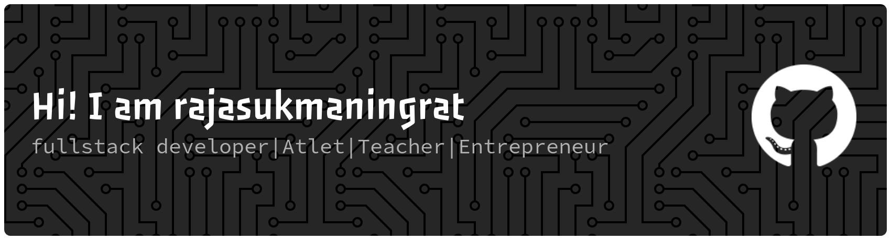

  

---

### 👨🏾‍🍳 Cooking Ware

  

    
    
    
    
    
    
    
    
    
    
    
    
    
    
    
    
  

---

### 🎮 Hobbies

Anime • Fight • Music • Game • Fishing

---

### 📫 Connect with me

  
  <a href="https://www.linkedin.com/in/raja-sukmaningrat-5b7a88402/">
    
  <a href="https://www.threads.com/@rajasukmaa?hl=en">
    

